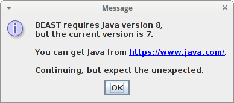

# FAQ

## Errors

### BEAST requires Java version 8

Sometimes my Java version degrades to version 7. BEAST2 will show this:

:

Solution: on the command-line do this:

```
sudo apt-get install oracle-java8-set-default
```

This will make BEAST2 issue a warning, but
you can alternively choose to use `openjdk`:

```
sudo apt-get install openjdk-8-jre
```

## Cannot find package rBEAST

Perhaps the prerequisites are missing:

```
if (is.element("adephylo", installed.packages()[, 1])) {
  print("package is already installed")
} else {
  install.packages("adephylo", repos = "http://cran.uk.r-project.org")
}
```

Then install it like this:

```
if (is.element("rBEAST", installed.packages()[, 1])) {
  print("package is already installed")
} else {
  devtools::install_github("richelbilderbeek/rBEAST")
}
```

## Cannot find xml2-config

This may happen when you install the `XML` package:

```
install.packages("XML")
[...]
checking for xml2-config... no
Cannot find xml2-config
```

Solution (from [Stack Overflow](http://stackoverflow.com/questions/7765429/unable-to-install-r-package-in-ubuntu-11-04)) 
is to install `libxml2-dev` on the command line.

```
sudo apt-get install libxml2-dev
```

Note: an alternative is to use

```
sudo apt-get install r-cran-xml
```
