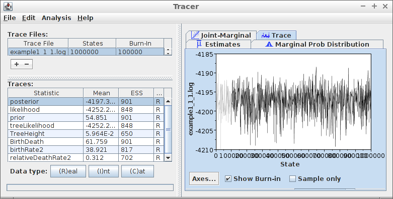

This document shows some work-out examples.

These worked-out examples show:

  * the error if protractedness is absent
  * the error if protractedness strong
  * comparing these errors
  * the error if protractedness is absent for multiple replicates
  * the error if protractedness is strong for multiple replicates
  * comparing these errors

## Workflow

Every experiment has the following steps:

 * Starting up
 * Creating parameter files
 * Per parameter file:
   * Simulate one incipient species tree per parameter file
   * Once or more often, sample unique species from an incipient species tree
   * Per sampled species tree, add an outgroup
   * Simulate one or more alignments per species tree
   * Once or more often, let BEAST2 infer a posterior per alignment
   * Compare original, sampled species tree, to the posterior
 * Per two parameter files:
   * Compare original, sampled species tree, to the posterior

## Starting up

We will need to load some libraries:

```{r}
library(ape)
library(Cer2016)
library(ggplot2)
library(Hmisc)
library(nLTT)
library(ribir)
library(phangorn)
```

We also set the resolution of our analysis:

```{r}
dt <- 0.001
```

I use `0.1` while developing code, 
`0.001` for a decent analysis.

## Creating parameter files

This worked-out example will show:

  * the error if protractedness is absent
  * the error if protractedness strong
  * comparing these errors
  * the error if protractedness is absent for multiple replicates
  * the error if protractedness is strong for multiple replicates
  * comparing these errors

For that, I will create four parameter files:

  * `toy_example_1.RDa`: protractedness is absent
  * `toy_example_2.RDa`: protractedness strong
  * `toy_example_3.RDa`: protractedness is absent for multiple replicates
  * `toy_example_4.RDa`: protractedness is strong for multiple replicates

Here, we create the four parameter filenames:

```{r}
filenames = c(
  "toy_example_1.RDa", 
  "toy_example_2.RDa", 
  "toy_example_3.RDa", 
  "toy_example_4.RDa"
)
```

To be sure to have a fresh analysis, we delete the files if they exist:

```{r}
#for (filename in filenames) {
#  if (file.exists(filename)) {
#    file.remove(filename)
#  }
#}
```

Now the parameter files are created with the desired parameters:

```{r}
rng_seeds <- seq(1,4)
sirgs <- rep(0.5, times = 4)
siris <- rep(0.5, times = 4)
scrs <- c(1.0e6, 1.0e-1, 1.0e6, 1.0e-1)
ergs <- rep(0.1, times = 4)
eris <- rep(0.1, times = 4)
ages <- rep(5, times = 4)
n_species_trees_sampleses <- c(1, 1, 2, 2)
mutation_rates <- rep(0.01, times = 4)
n_alignmentses <- c(1, 1, 2, 2)
sequence_lengths <- rep(1000, times = 4)
mcmc_chainlengths <- rep(10000, times = 4)
n_beast_runses <- c(1, 1, 2, 2)
for (i in seq(1, 4)) {
  save_parameters_to_file(
    rng_seed = rng_seeds[i],
    sirg = sirgs[i],
    siri = siris[i],
    scr = scrs[i],
    erg = ergs[i],
    eri = eris[i],
    age = ages[i],
    n_species_trees_samples = n_species_trees_sampleses[i],
    mutation_rate = mutation_rates[i],
    n_alignments = n_alignmentses[i],
    sequence_length = sequence_lengths[i],
    mcmc_chainlength = mcmc_chainlengths[i],
    n_beast_runs = n_beast_runses[i],
    filename = filenames[i]
  )  
}
```

  * `toy_example_1.RDa`: protractedness is absent, thus speciation completion rate is high, in this case `1.0e6`
  * `toy_example_2.RDa`: protractedness strong, thus speciation completion rate is low, in this case `1.0e-1`
  * `toy_example_3.RDa`: protractedness is absent for multiple replicates, thus number of sampled species trees, alignments per species trees, and BEAST2 runs are all 2
  * `toy_example_4.RDa`: protractedness is strong for multiple replicates,  thus number of sampled species trees, alignments per species trees, and   BEAST2 runs are all 2
  
Here the parameters are shown in a nicer format:

```{r}
show_parameter_files(filenames)
```

The parameter settings used in this example are identical, 
except for their speciation completion rate and number of replicates. 

The experimental setup of this research has multiple steps, which we will follow closely here. 

These worked-out examples show the data produced in its raw form and does not care too much about aesthetics.

## Example 1: Weak protractedness

This example answers the question: what is the base level error of 
the analyses in this research?

The base level error can be obtained by using parameters for a 
constant-rate birth-death model. All tools used assume this model, 
but there will be noise (thus error) added in the process. 

The parameter settings of example 1 have a high speciation 
completion rate \lambda, which makes the constant-rate 
protracted speciation model fall back to a 
constant-rate birth-death model, 
as incipient species become good species (close to) instantaneously.

### Simulate one incipient species tree per parameter file

Here we simulate the 'true' incipient species tree:

```{r}
filename <- filenames[1]
testit::assert(is_valid_file(filename))
add_pbd_output(filename)
```

This is how the incipient species tree looks like:

```{r}
colors <- setNames(c("gray","black"),c("i","g"))
testit::assert(length(read_file(filename)$pbd_output$igtree.extant$tip.label) > 0)
phytools::plotSimmap(
  read_file(filename)$pbd_output$igtree.extant, 
  colors = colors
)
```

The taxon labels are S[genus]-[species]-[sub-species]'.

Now, we plot the nLTT plot of this phylogeny:

```{r}
nltt_values <- get_nltt_values(
  phylogenies = list(read_file(filename)$pbd_output$tree), 
  dt = 0.001
)
qplot(
  t, nltt, data = nltt_values, geom = "blank", ylim = c(0,1),
  main = "Example #1"
) + stat_summary(
  fun.data = "mean_cl_boot", color = "red", geom = "smooth"
)
```

Note that `get_nltt_values` is supplied a list of the one 
incipient species tree. This is because `get_nltt_values` 
works on a list of phylogenies.

### Once or more often, sample unique species from an incipient species tree. Also add an outgroup

From that incipient species tree, 
we create a species tree by sampling one individual 
per incipient species. Because speciation is for a 
constant-rate birth death model, there exist no multiple individuals 
per species. To being able to root our phylogenies in later steps, an outgroup is added as well.

```{r}
add_species_trees_with_outgroup(filename)  
```

Here we observe the sample species tree:

```{r}
plot_species_tree_with_outgroup(filename)
```

Note that in example #3, there will be multiple sampled
species trees. 

### Simulate one or more alignments per species tree

Knowing the evolutionary distances between species, DNA sequence alignments can be simulated fitting the species tree with outgroup. 
To do so, the parameters for sequence length and mutation rate are used.

Here we simulate one DNA sequence on our one sampled species tree
with outgroup:

```{r}
add_alignments(filename)  
```

Note that this research assumes a simple Jukes-Cantor model, and does so as well in later steps.

Let's see the alignment:

```{r}
plot_alignments(filename)
```

### Once or more often, let BEAST2 infer a posterior per alignment

With BEAST2 we can now obtain a posterior. A posterior consists of a representative sample of all possible trees (and parameter estimates), yet with more probable trees being present more often.

Here we let BEAST2 do so:

```{r}
add_posteriors(filename, skip_if_output_present = TRUE)
```

After running BEAST2 on our DNA sequence, the full posterior must be verified to be eligible for further analysis. Using Tracer, we can open the .log file generated by BEAST2, which is then displayed here:



(note: this picture is not freshly generated and may thus be incorrect)

It can be seen that the values for ESS (Effective Sample Size) are above 200 and that the trace log shows a well-mixed chain. An ESS of 200 is used as a minimum in this research. 

A posterior contains many phylogenies. To visualize these, 
they are extracted from a `.trees` file here:

```{r}
trees_filename <- "toy_example_1_1_1_1.trees"
testit::assert(file.exists(trees_filename))
phylogenies <- rBEAST::beast2out.read.trees(trees_filename)
# To get the densiTree function working, phylogenies must be of class multiphylo
class(phylogenies) <- "multiPhylo"
```

Then, these posterior trees are plotted:

```{r fig.width = 7, fig.height = 7}
densiTree(
  phylogenies, 
  type = "cladogram", 
  alpha = 1/length(phylogenies)
)
```

From this plot, it can be seen which phylogeny configurations
pop up most in the posterior.

### Compare original, sampled species tree, to the posterior

To refresh our mind, the true sampled species tree is:

```{r}
plot_species_tree_with_outgroup(filename)
plot_species_tree_with_outgroup_nltt(filename, dt = dt)
```

Now that the full posterior is assumed to be correct, 
first, I will now highlight one of its posterior states,
before going back to the full picture. 

In this case, I choose a random state to zoom in on. 
From this last state, I show the tree only:

```{r}
plot_posterior_samples(filename)
```

This random tree may be very different by chance, 
as unlikely trees are present, yet in low abundances. 

The original sampled tree is very probably different from this
random posterior tree.

How different then?

There are multiple ways to quantify this:

 * The gamma statistic
 * The nLTT statistic

#### The gamma statistic

The gamma value is a summary statistic described in [2]

First, I collect the gamma statistics from the species 
tree(s) with outgroup(s):

```{r}
true_gamma_statistics <- collect_species_tree_gammas(filename = filename)
knitr::kable(head(true_gamma_statistics))
```

In this case, there will be one statistics, as we only
have one species tree.

Then, I collect the gamma statistics from the posterior(s):

```{r}
posterior_gamma_statistics <- collect_posterior_gammas(
  filename = filename
)
knitr::kable(head(posterior_gamma_statistics))
```


#### The nLTT statistic

The nLTT value is a summary statistic described in [1]

First, I collect the nLTT values from the species 
tree(s) with outgroup(s):

```{r}
true_nltt_values <- collect_species_tree_nltts(filename = filename, dt = dt)
knitr::kable(head(true_nltt_values))
```

Then, I collect the nLTT values from the posterior(s):

```{r}
posterior_nltt_values <- collect_posterior_nltt_values(
  filename = filename, dt = dt
)
knitr::kable(head(posterior_nltt_values))
```

Last, I plot both of these:

```{r}
ggplot2::ggplot(
  data = posterior_nltt_values,
  ggplot2::aes(t, nltt),
  main = "nLTT plots"
) + ggplot2::geom_point(
  color = "transparent"
) + ggplot2::scale_x_continuous(
  limits = c(0, 1)
) + ggplot2::scale_y_continuous(
  limits = c(0, 1)
) + ggplot2::stat_summary(
  fun.data = "mean_cl_boot", size = 0.5, lty = "dashed",
  color = I("black"), geom = "smooth"
) + ggplot2::geom_step(
  data = true_nltt_values,
  ggplot2::aes(t, nltt)
)
```

How do we interpret these results? Well, even *if* we
follow all assumptions, this will be standard errors we
will make; this is the minimal level of imperfection.

Note that the error is not quantified (using `nLTT::nLTTstat`),
only visualized

## References

 * [1] Janzen, Thijs, Sebastian Höhna, and Rampal S. Etienne. "Approximate Bayesian Computation of diversification rates from molecular phylogenies: introducing a new efficient summary statistic, the nLTT." Methods in Ecology and Evolution 6.5 (2015): 566-575.
 * [2] Pybus and someone else